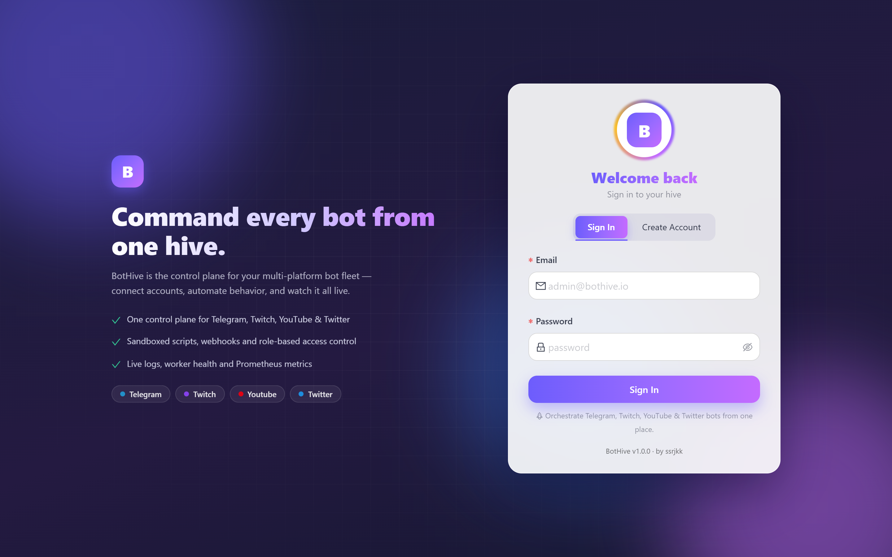
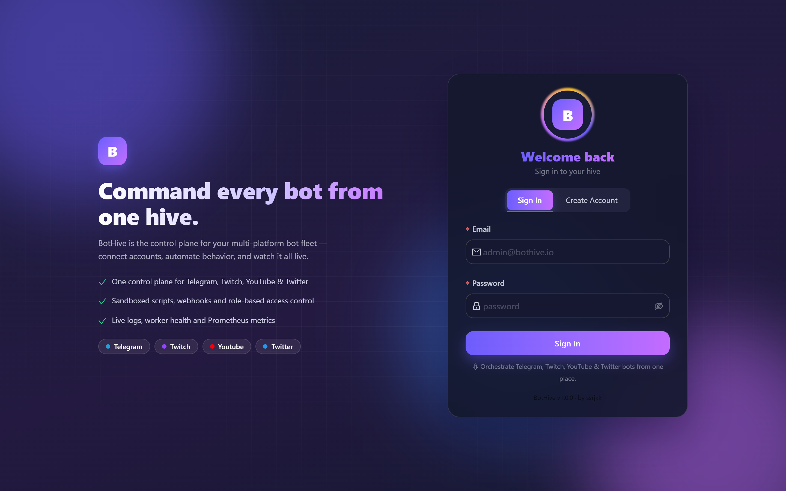
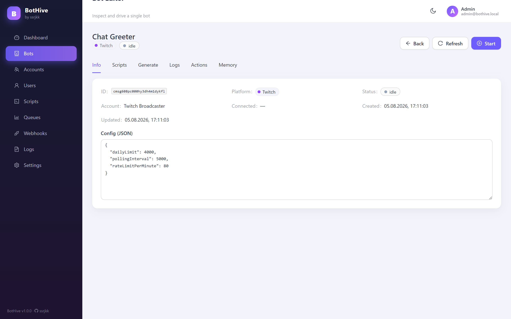
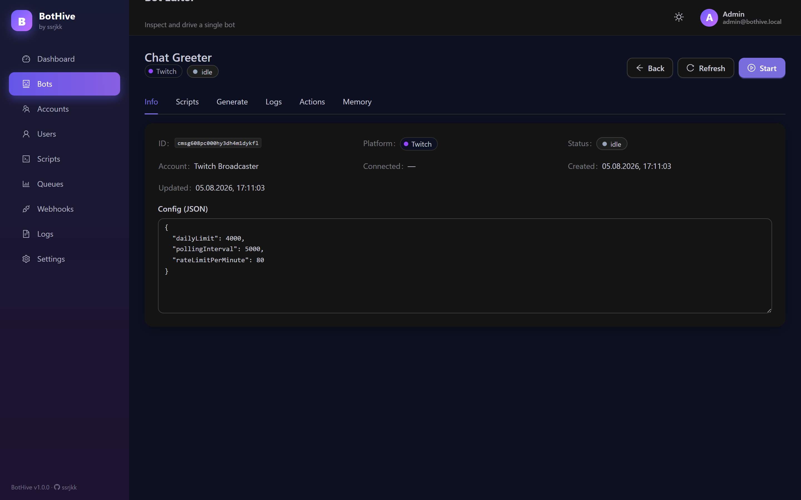
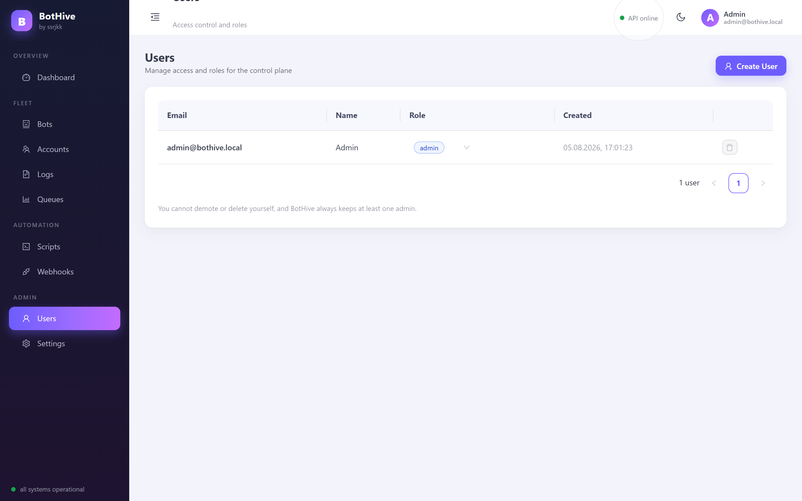
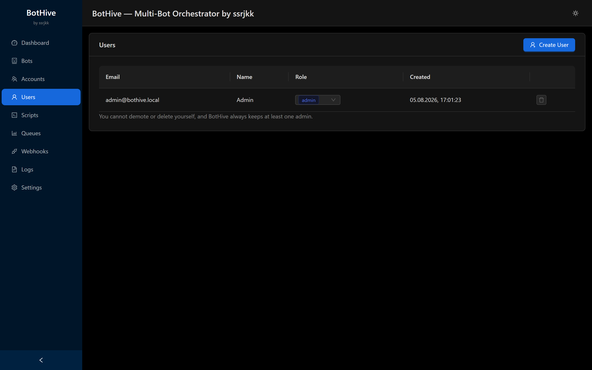
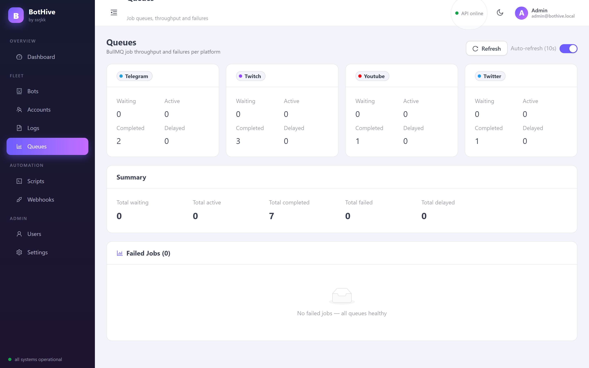
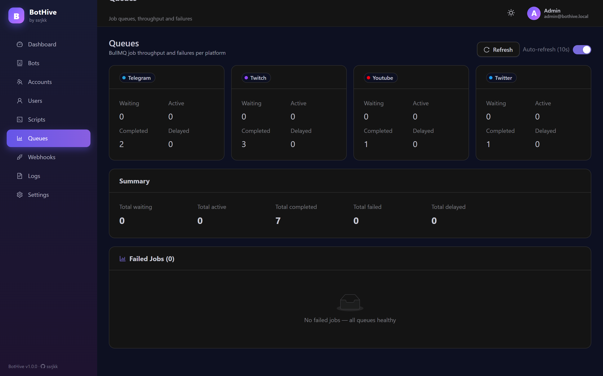
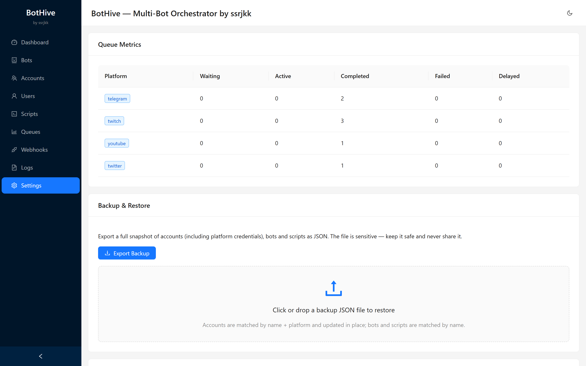
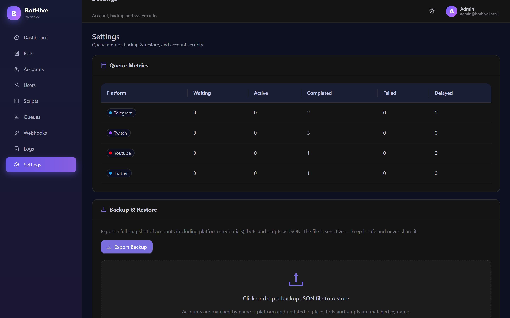

# 🐝 BotHive

**Multi-bot orchestration platform for Telegram, Twitch, YouTube and Twitter.**

> by **ssrjkk** — run a fleet of social bots with shared infrastructure: one API, one queue layer, one dashboard, one script engine.


---

## Docs

- [API reference](docs/api.md) · [Script engine](docs/scripts.md) · [Webhooks](docs/webhooks.md)
- [Deployment](docs/deployment.md) · [Security model](docs/security.md) · [Security policy](SECURITY.md)
- [Backup & restore](docs/backup.md) · [Capacity planning](docs/capacity-planning.md) · [Troubleshooting](docs/troubleshooting.md)
- [SLOs & alerting](docs/slo.md) · [Load testing](load/README.md)
- [Architecture decisions](docs/adr/README.md) · [Runbooks](docs/runbooks/README.md)

---

## Screenshots

The admin dashboard ships with light and dark themes.

| Page           | Light                                                                                         | Dark                                                                                        |
| -------------- | --------------------------------------------------------------------------------------------- | ------------------------------------------------------------------------------------------- |
| **Sign in**    |        |        |
| **Dashboard**  |  |  |
| **Bots**       |               |               |
| **Bot editor** |        |        |
| **Accounts**   |       |       |
| **Users**      |             |             |
| **Scripts**    |         |         |
| **Queues**     |           |           |
| **Webhooks**   |       |       |
| **Logs**       |               |               |
| **Settings**   |       |       |

## What it does

BotHive lets you register **accounts** and **bots** for four platforms, start/stop them from one place, automate them with **sandboxed scripts**, react to events through **webhooks**, and observe everything on a single **dashboard** with Prometheus metrics.

- **4 platform adapters** — Telegram (long-polling), Twitch (IRC + Helix), YouTube (LiveChat), Twitter (v2 API)
- **Queue-driven control plane** — every connect / disconnect / action is a BullMQ job, so control is reliable and restart-safe
- **Script engine** — attach event-driven or interval scripts to any bot (`message`, `follow`, `subscribe`, `donation`, `comment`, `interval`)
- **Webhook sink** — push events to your own endpoints with HMAC signatures and SSRF protection
- **RBAC** — `admin` / `viewer` roles resolved from the database on every request (not from a stale JWT claim); admins can create/delete users and change roles in the dashboard
- **Secrets at rest** — account tokens are encrypted with AES-256-GCM; encryption keys are validated at startup
- **Proxy pool** — manage HTTP/SOCKS5 outbound proxies per-bot; the leader worker rotates healthy proxies with priority weighting, failure cooldown and health decay/boost, and `POST /api/proxies/:id/test` runs a reachability probe
- **Backup & restore** — one-click JSON export/import with an atomic transaction and encrypted credential round-trips
- **Observability** — `/metrics` for Prometheus, queue depth per platform, per-bot status and log stream, live worker health per platform, and a dark/light theme

---

## Architecture

```
┌─────────────────────┐        ┌──────────────────────────────┐
│  Dashboard (nginx)  │        │  API (Fastify + Prisma)      │
│  React + antd       │──/api──▶  auth · bots · accounts ·    │
│                     │        │  scripts · webhooks · logs · │
└─────────────────────┘        │  stats · queues · backup     │
                               └───────┬──────────────┬───────┘
                                       │ enqueue      │ CRUD + config
                                       ▼              ▼
                              ┌───────────────┐  ┌──────────────┐
                              │  Redis        │  │ PostgreSQL   │
                              │  BullMQ queues│  │ (Prisma ORM) │
                              │  memory store │  └──────────────┘
                              └───────┬───────┘
                                      ▼ consume
        ┌───────────────┬────────────────┴───────────────┬───────────────┐
        ▼               ▼                                ▼               ▼
  workers-telegram  workers-twitch               workers-youtube   workers-twitter
  (one process per platform — a crash never takes down the others)
```

**Monorepo layout**

| Package              | Role                                                                                                                                    |
| -------------------- | --------------------------------------------------------------------------------------------------------------------------------------- |
| `packages/core`      | Domain logic: CQRS commands, validation, credential cipher, rate limiters, webhook signing, script config safety, VM-friendly event bus |
| `packages/api`       | Fastify HTTP API, JWT auth + RBAC, BullMQ enqueuing, Prisma schema/migrations, Prometheus metrics                                       |
| `packages/workers`   | BullMQ consumers + platform adapters (grammy, tmi.js, twurple, googleapis, twitter-api-v2), script engine, webhook dispatcher           |
| `packages/dashboard` | React + antd admin panel (lazy-loaded pages, admin-gated routes)                                                                        |

---

## Quick start (Docker)

```bash
# 1. prepare secrets (copy the example and fill in ENCRYPTION_KEY / PASSWORD_PEPPER / JWT_SECRET)
cp .env.example .env

# 2. start the whole stack — postgres, redis, api, per-platform workers, dashboard, prometheus, grafana
docker compose up -d --build
```

- Dashboard: **http://localhost:80**
- API: **http://localhost:3000**
- Prometheus: **http://localhost:9090** · Grafana: **http://localhost:3001** (pre-configured Prometheus datasource + **BotHive — API overview** dashboard; default login `admin`/`admin`, override via `GF_ADMIN_PASSWORD`)
- First admin user: `npx prisma db seed` creates `admin@botfarm.local` / `admin123` (change it!).

> One worker process runs per platform (`workers-telegram`, `workers-twitch`, …). Scale any of them independently:
> `docker compose up -d --scale workers-telegram=3`

## Local development

```bash
npm install
docker compose up -d postgres redis     # just the infra

npm run dev                              # api + workers + dashboard (workspaces)
```

Run checks:

```bash
npm run check      # lint + build + typecheck + tests — one command
npm run build      # TypeScript across all workspaces
npm run lint
npm run typecheck  # typechecks sources AND tests (build skips __tests__)
npm run coverage   # vitest with coverage thresholds (enforced in CI)
npm test           # vitest
```

---

## Configuration

Key environment variables (see [`.env.example`](.env.example) for the full list with comments):

| Variable                     | Required | Purpose                                                                                                           |
| ---------------------------- | -------- | ----------------------------------------------------------------------------------------------------------------- |
| `DATABASE_URL`               | ✅       | PostgreSQL connection string                                                                                      |
| `REDIS_URL`                  | ✅       | Redis for BullMQ queues, bot memory and pub/sub                                                                   |
| `REDIS_PASSWORD`             |          | Redis auth password (also usable in the URL)                                                                      |
| `REDIS_SENTINELS`            |          | `host:port[,host:port,...]` — switch all Redis connections to Sentinel (HA/failover); `REDIS_URL` is then ignored |
| `REDIS_SENTINEL_NAME`        |          | Sentinel master name (default `mymaster` when sentinels are set)                                                  |
| `REDIS_TLS`                  |          | `true` enables TLS for cloud-managed Redis                                                                        |
| `REDIS_DB`                   |          | Numeric logical Redis DB index for all connections                                                                |
| `ENCRYPTION_KEY`             | ✅       | 32-byte hex key for AES-256-GCM credential encryption                                                             |
| `JWT_SECRET`                 | ✅       | Session signing secret                                                                                            |
| `PASSWORD_PEPPER`            | ✅       | Pepper mixed into scrypt password hashes                                                                          |
| `API_PORT` / `API_HOST`      |          | API listen address                                                                                                |
| `LOG_RETENTION_DAYS`         |          | Automatic log cleanup window (default `30`)                                                                       |
| `WORKER_CONCURRENCY`         |          | BullMQ jobs processed concurrently per worker (default `10`)                                                      |
| `INTERVAL_POLL_MS`           |          | Interval-script polling frequency (default `30000`)                                                               |
| `ALLOW_PRIVATE_WEBHOOK_URLS` | ⛔       | **Never** enable in production (SSRF)                                                                             |
| `WEBHOOK_DNS_CHECK`          |          | Resolve webhook hostnames and block private IPs                                                                   |

> Rotating `ENCRYPTION_KEY` makes previously stored credentials undecryptable — keep it stable.

---

## Script engine

Scripts are attached to a bot and fire on platform events or a timer. They run inside a hardened **Node `vm` sandbox**: `fetch` is SSRF-guarded on every redirect hop, the host realm cannot leak functions, return values are sanitized, and infinite loops are killed by a timeout. A per-script `maxExecutionMs` (100–600 000 ms, default 60 s) caps the whole action chain against a wall-clock deadline — the chain aborts between steps once it's exceeded.

**Triggers:** `message` · `follow` · `subscribe` · `donation` · `comment` · `interval`

**Actions exposed to scripts:** `sendMessage`, `sendPhoto`, `deleteMessage`, `say`, `timeout`, `tweet`, `reply`, `react`, `log`, `fetch`, `remember(key, value, ttl)`, `recall(key)`, `forget(key)`.

Safety checks run at save time too — the API rejects scripts with catastrophic regex filters, sandbox-escaping custom code, or disallowed webhook URLs (also enforced on backup import).

---

## Webhooks

Bots can push events to your endpoints. Webhooks support per-bot or global (`botId: null`) targets, event filtering, HMAC signing (`X-BotHive-Signature`) and delivery telemetry (status, error, last delivered, delivery count). Private/loopback URLs are blocked by default to prevent SSRF, and an optional DNS check blocks hostnames that resolve to private ranges.

## Resilience

Workers stay polite when platforms are unhappy, instead of hammering them:

- **Per-bot circuit breaker** (`packages/core/src/resilience/circuit-breaker.ts`): after 5 consecutive connect failures the connection circuit opens and reconnects stop; one probe is let through per 60s cooldown, and a single successful connect closes it again. Reconcile/auto-start also skips bots whose circuit is open.
- **Adaptive backoff** (`packages/core/src/resilience/adaptive-backoff.ts`): reconnect delays are exponential with jitter (no more fixed `[5s, 15s, 30s, 60s, 120s]` table) and scale with the bot's recent failure rate, capped at 5 minutes — so a fleet never reconnects in lock-step and a failing bot backs off hard.
- **Health score** (`packages/core/src/resilience/health-score.ts`): every connect and action outcome feeds a 1-hour sliding window that yields a 0-100 score per bot. Workers publish these to Redis and the API's `/metrics` exposes them as `bothive_bot_health_score{bot_id="...",status="..."}`, plus `bothive_bot_uptime_seconds`, `bothive_bot_actions_total{result="success|failure"}`, `bothive_bot_reconnect_attempts_total` and `bothive_bot_script_executions_total`.
- **Per-bot rate limits**: set `rateLimitPerMinute` in a bot's config to enforce a separate outbound budget for that bot (in addition to the global per-window limit). Limits are enforced via Redis, so they hold across a scaled fleet.
- **Proxy pool** (`packages/core/src/proxy/proxy-pool.ts`): the leader worker reloads proxies from the DB every reconcile cycle and injects a healthy one (`proxy`/`proxyType`) into each connect. Selection is weighted by priority with round-robin rotation, a failed proxy enters a 30s cooldown, and every connect outcome feeds its health score (`bothive_proxy_health_score{proxy_id,type,priority}`).

## Database performance

- **Indexes** (`packages/api/prisma/migrations/`): hot query paths are indexed — accounts by platform, bots by `(platform, status)` and by `accountId`, scripts by `(botId, trigger)` and `enabled`, webhooks by `botId`, logs by `(botId, createdAt)`, `(botId, level)` and `createdAt`.
- **Bounded pagination**: list endpoints cap results via `parsePage` (100 per page, 1000 max, skip capped at 100 000) so deep paging can't grind the DB.
- **Filterable bot list**: `GET /api/bots` accepts `?platform=`, `?status=` and `?q=` (name substring, case-insensitive) — all index-friendly and validated.
- **Connection pooling**: each service's Prisma pool is bounded via `DATABASE_URL?...&connection_limit=10` (see `docker-compose.yml` and `.env.example`) so a scaled worker fleet cannot exhaust Postgres connections.

## Observability & alerting

- **Prometheus metrics** (`GET /metrics`): HTTP counters/histograms (rate, latency, response size per route), queue depths per platform/state (`bothive_queue_jobs_total`, `bothive_worker_queue_depth`), per-bot health/uptime/action/reconnect/script-execution metrics, worker liveness and concurrency (`bothive_worker_up`, `bothive_worker_concurrency_current`), proxy health scores, Prisma row counts and Node runtime gauges. Protected by `METRICS_TOKEN`, JWT, or `METRICS_OPEN=true`.
- **Readiness** (`GET /health/ready`) probes both Postgres and Redis (503 when either is unavailable) — it is safe to use as a load-balancer/K8s readiness probe.
- **Alerting** (`prometheus/rules/bothive.yml`): 9 rules — API unreachable/high error rate/slow p95, workers down, queue backlog, stuck failed jobs, unhealthy bots, unhealthy proxies. Prometheus evaluates them and the bundled Alertmanager holds them (see `alertmanager.yml` to wire a webhook/email receiver).

---

## Security model

- Credentials are **encrypted at rest** (AES-256-GCM) and never returned by the API — including webhook HMAC secrets (`enc:`-prefixed, legacy plaintext keeps working on read).
- Sessions use **httpOnly cookies** + short-lived JWTs; roles are re-read from the database per request (fail-closed: unknown role ⇒ `viewer`). WebSocket log streams re-check the user too.
- Login is **rate-limited**; passwords are hashed with **scrypt** plus a pepper.
- **RBAC**: only `admin` can manage scripts, queues, webhooks, settings, backups and bulk operations; `viewer` gets read-only access.
- The API and dashboard emit security headers on every response, including **HSTS**; auth responses that carry the token in the body set `Cache-Control: no-store`.
- Webhook delivery and script `fetch` are SSRF-hardened; bulk operation errors are masked instead of echoing raw exceptions.

---

## API surface (abridged)

```
GET   /health, /health/ready, /metrics · GET /api/health/workers
POST  /api/auth/register, /api/auth/login, /api/auth/logout
GET   /api/auth/me · PATCH /api/auth/password
GET/POST /api/auth/users · PATCH /api/auth/users/:id/role · DELETE /api/auth/users/:id
GET   /api/bots · POST /api/bots · GET/PATCH/DELETE /api/bots/:id
POST  /api/bots/:id/start · /stop · /action · GET/DELETE /api/bots/:id/memory[/:key]
GET   /api/accounts · POST /api/accounts · PATCH/DELETE /api/accounts/:id
GET   /api/scripts/patterns · POST /api/scripts/generate · CRUD /api/scripts
POST  /api/scripts/:id/test · /clone · /test
GET   /api/webhooks · CRUD /api/webhooks · POST /api/webhooks/:id/test
GET   /api/queues · /api/queues/failed · /api/logs · /api/stats
GET/POST /api/proxies · GET/PATCH/DELETE /api/proxies/:id · POST /api/proxies/:id/test
GET   /api/backup/export · POST /api/backup/import
```

---

## Testing

Vitest across all workspaces — **323 tests** covering domain rules, RBAC, sandbox isolation, webhook SSRF guards, backup round-trips, leader election, circuit breakers, rate limiting, proxy rotation/health, Redis connection options and API behaviour. Coverage thresholds are enforced in CI.

```bash
npm test
```

---

## CI/CD & releases

- **CI** (`.github/workflows/ci.yml`) runs on every push/PR: ESLint, full build, typecheck of sources _and_ tests, the whole test suite with coverage on Node 20 **and** 22, `docker compose` validation, and a Docker build of every image target (api / workers / dashboard). On `main` the images are pushed to Docker Hub as `:latest` and `:<sha>`; PRs build them locally so a broken Dockerfile is caught before merge.
- **Releases** (`.github/workflows/release.yml`) — push a semver tag and the images are published as `:latest`, `:<tag>` and `:<sha>`, plus a draft GitHub release with a changelog:

  ```bash
  git tag v1.2.3 && git push origin v1.2.3
  ```

- **Dependabot** (`.github/dependabot.yml`) keeps npm, Docker and GitHub Actions dependencies up to date weekly.

Secrets required for image publishing: `DOCKERHUB_USERNAME`, `DOCKERHUB_TOKEN` (configured in the repo settings).

## Author

**Sitnikov Sergey Alekseevich**
QA Automation Engineer · Saint Petersburg  
[GitHub](https://github.com/ssrjkk) · [Telegram](https://t.me/ssrjkk) · ray013lefe@gmail.com

---

## License

MIT — see [LICENSE](LICENSE). Contributions are welcome: read [CONTRIBUTING](CONTRIBUTING.md) and the [Code of Conduct](CODE_OF_CONDUCT.md) first.
