# 🐝 BotHive

**Multi-bot orchestration platform for Telegram, Twitch, YouTube and Twitter.**

> by **ssrjkk** — run a fleet of social bots with shared infrastructure: one API, one queue layer, one dashboard, one script engine.


---

## Docs

- [API reference](docs/api.md) · [Script engine](docs/scripts.md) · [Webhooks](docs/webhooks.md)
- [Deployment](docs/deployment.md) · [Security model](docs/security.md) · [Security policy](SECURITY.md)

---

## Screenshots

The admin dashboard ships with light and dark themes.

| Page | Light | Dark |
|---|---|---|
| **Dashboard** | 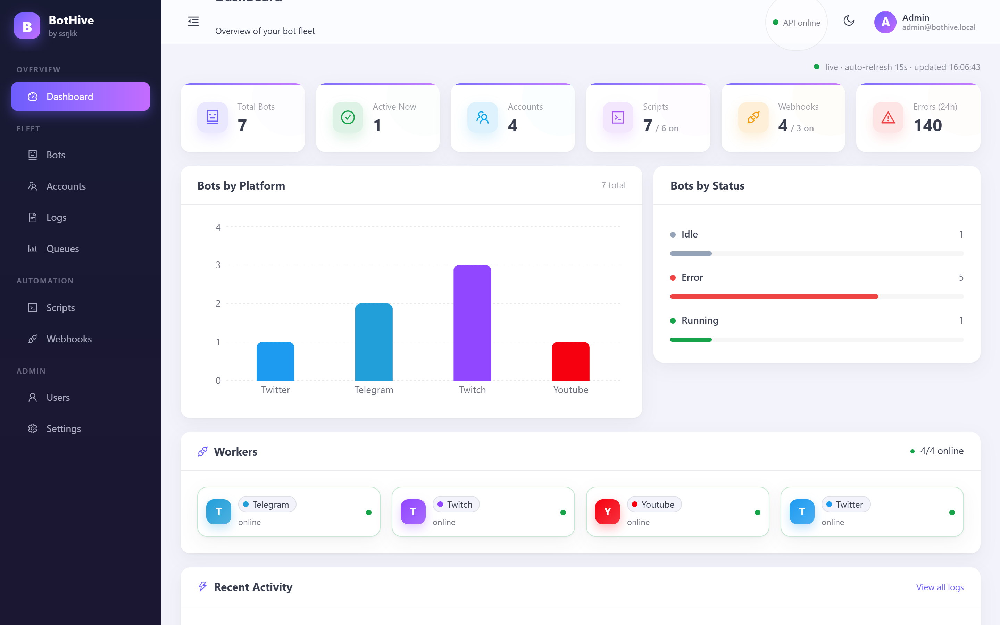 | 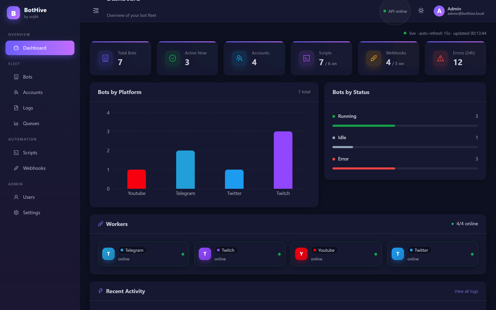 |
| **Bots** | 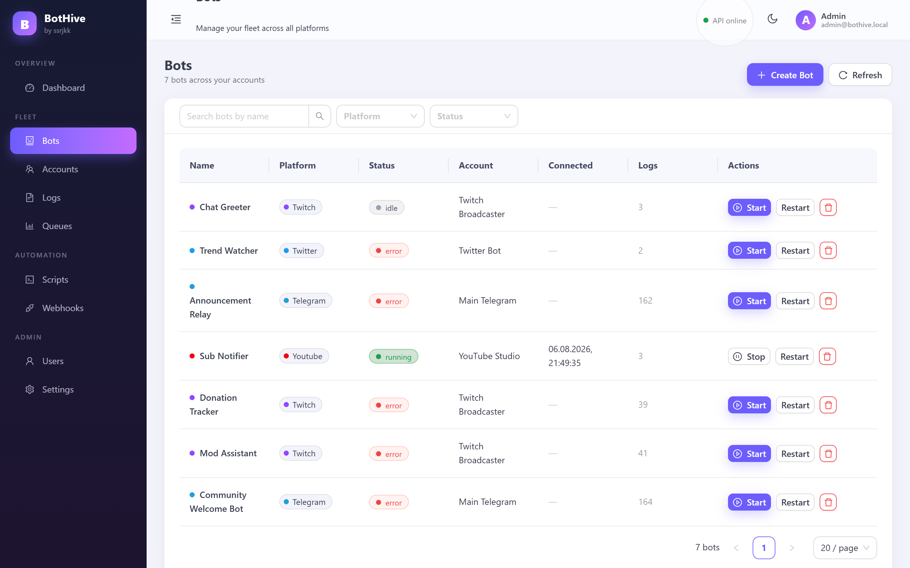 | 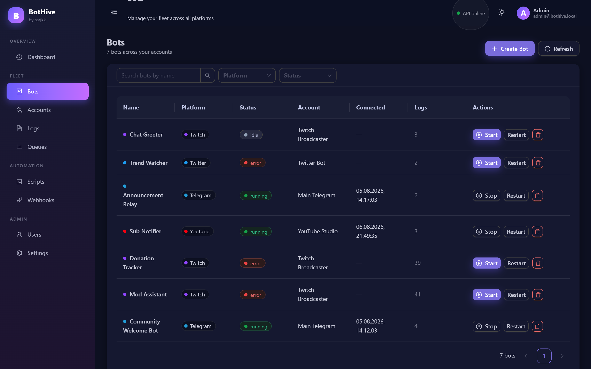 |
| **Accounts** | 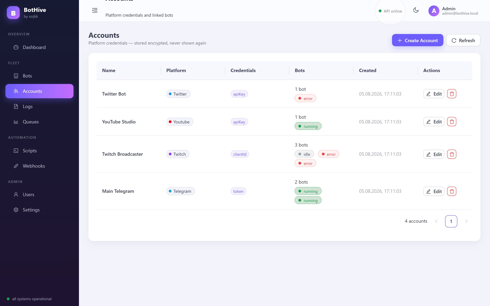 | 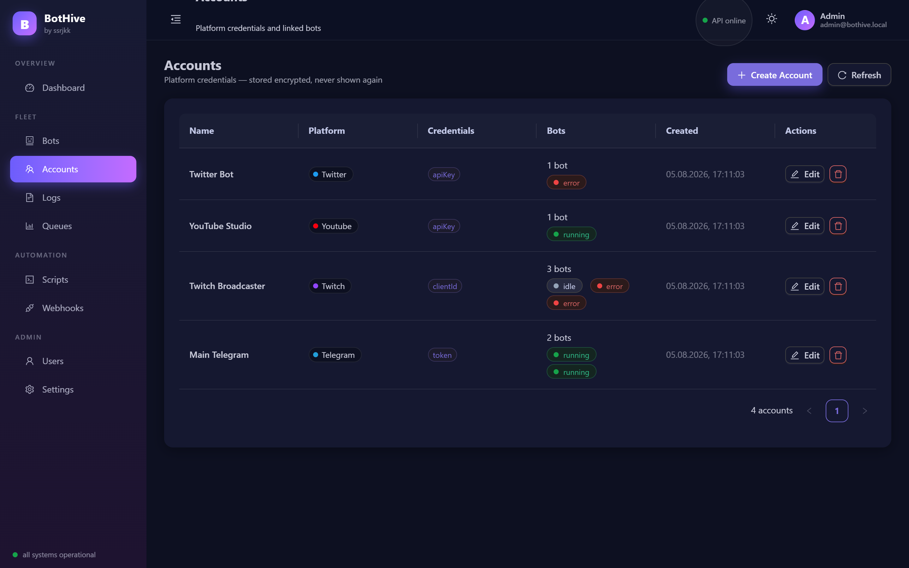 |
| **Scripts** | 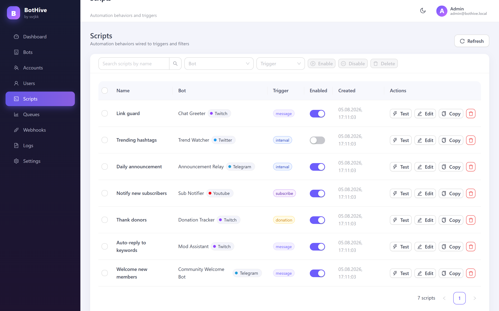 | 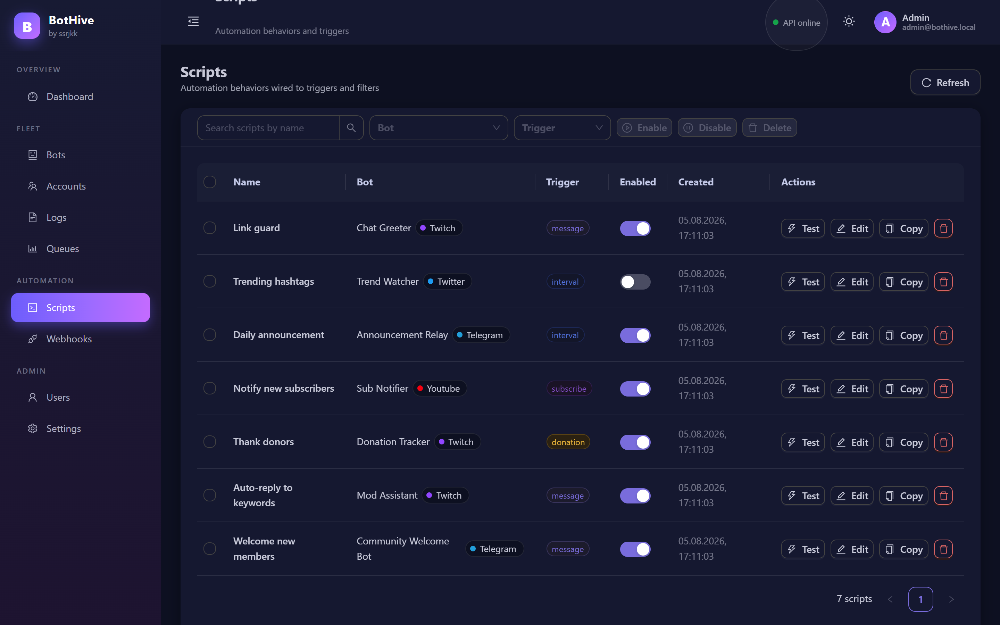 |
| **Webhooks** | 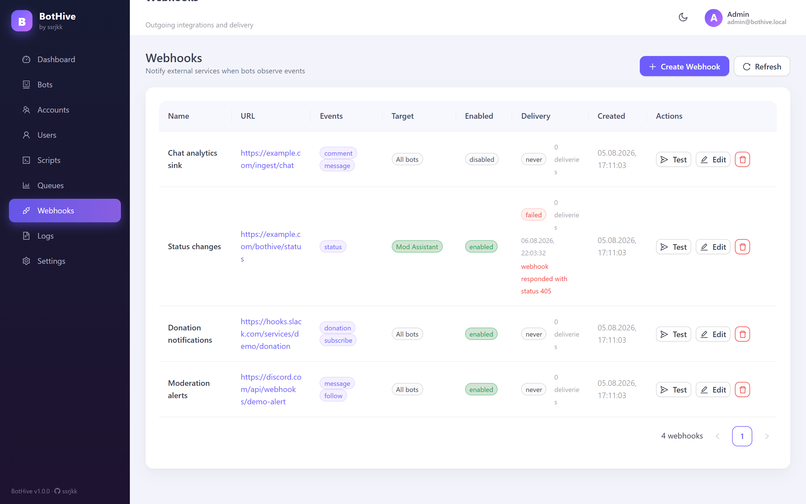 | 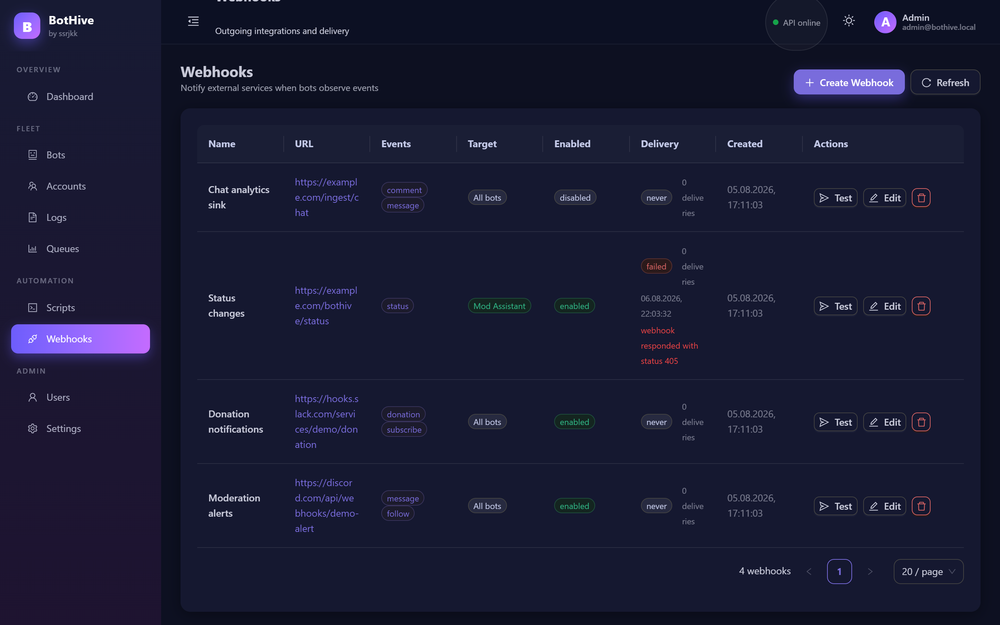 |
| **Logs** | 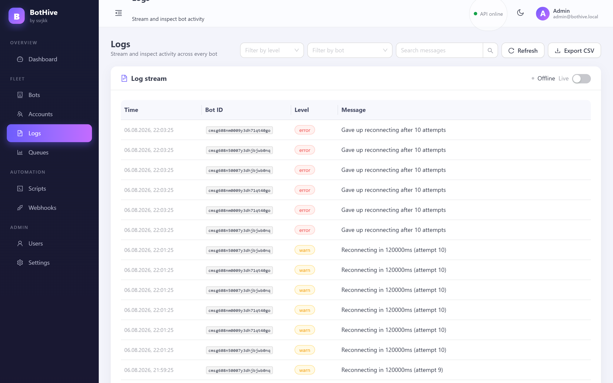 | 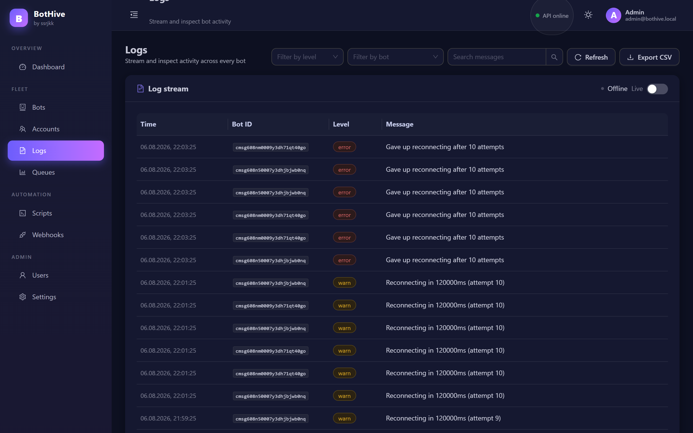 |

## What it does

BotHive lets you register **accounts** and **bots** for four platforms, start/stop them from one place, automate them with **sandboxed scripts**, react to events through **webhooks**, and observe everything on a single **dashboard** with Prometheus metrics.

- **4 platform adapters** — Telegram (long-polling), Twitch (IRC + Helix), YouTube (LiveChat), Twitter (v2 API)
- **Queue-driven control plane** — every connect / disconnect / action is a BullMQ job, so control is reliable and restart-safe
- **Script engine** — attach event-driven or interval scripts to any bot (`message`, `follow`, `subscribe`, `donation`, `comment`, `interval`)
- **Webhook sink** — push events to your own endpoints with HMAC signatures and SSRF protection
- **RBAC** — `admin` / `viewer` roles resolved from the database on every request (not from a stale JWT claim); admins can create/delete users and change roles in the dashboard
- **Secrets at rest** — account tokens are encrypted with AES-256-GCM; encryption keys are validated at startup
- **Backup & restore** — one-click JSON export/import with an atomic transaction and encrypted credential round-trips
- **Observability** — `/metrics` for Prometheus, queue depth per platform, per-bot status and log stream, live worker health per platform, and a dark/light theme

---

## Architecture

```
┌─────────────────────┐        ┌──────────────────────────────┐
│  Dashboard (nginx)  │        │  API (Fastify + Prisma)      │
│  React + antd       │──/api──▶  auth · bots · accounts ·    │
│                     │        │  scripts · webhooks · logs · │
└─────────────────────┘        │  stats · queues · backup     │
                               └───────┬──────────────┬───────┘
                                       │ enqueue      │ CRUD + config
                                       ▼              ▼
                              ┌───────────────┐  ┌──────────────┐
                              │  Redis        │  │ PostgreSQL   │
                              │  BullMQ queues│  │ (Prisma ORM) │
                              │  memory store │  └──────────────┘
                              └───────┬───────┘
                                      ▼ consume
        ┌───────────────┬────────────────┴───────────────┬───────────────┐
        ▼               ▼                                ▼               ▼
  workers-telegram  workers-twitch               workers-youtube   workers-twitter
  (one process per platform — a crash never takes down the others)
```

**Monorepo layout**

| Package | Role |
|---|---|
| `packages/core` | Domain logic: CQRS commands, validation, credential cipher, rate limiters, webhook signing, script config safety, VM-friendly event bus |
| `packages/api` | Fastify HTTP API, JWT auth + RBAC, BullMQ enqueuing, Prisma schema/migrations, Prometheus metrics |
| `packages/workers` | BullMQ consumers + platform adapters (grammy, tmi.js, twurple, googleapis, twitter-api-v2), script engine, webhook dispatcher |
| `packages/dashboard` | React + antd admin panel (lazy-loaded pages, admin-gated routes) |

---

## Quick start (Docker)

```bash
# 1. prepare secrets (copy the example and fill in ENCRYPTION_KEY / PASSWORD_PEPPER / JWT_SECRET)
cp .env.example .env

# 2. start the whole stack — postgres, redis, api, per-platform workers, dashboard, prometheus, grafana
docker compose up -d --build
```

- Dashboard: **http://localhost:80**
- API: **http://localhost:3000**
- Prometheus: **http://localhost:9090** · Grafana: **http://localhost:3001** (pre-configured Prometheus datasource + **BotHive — API overview** dashboard; default login `admin`/`admin`, override via `GF_ADMIN_PASSWORD`)
- First admin user: `npx prisma db seed` creates `admin@botfarm.local` / `admin123` (change it!).

> One worker process runs per platform (`workers-telegram`, `workers-twitch`, …). Scale any of them independently:
> `docker compose up -d --scale workers-telegram=3`

## Local development

```bash
npm install
docker compose up -d postgres redis     # just the infra

npm run dev                              # api + workers + dashboard (workspaces)
```

Run checks:

```bash
npm run build    # TypeScript across all workspaces
npm run lint
npm test         # vitest (244 tests)
```

---

## Configuration

Key environment variables (see [`.env.example`](.env.example) for the full list with comments):

| Variable | Required | Purpose |
|---|---|---|
| `DATABASE_URL` | ✅ | PostgreSQL connection string |
| `REDIS_URL` | ✅ | Redis for BullMQ queues, bot memory and pub/sub |
| `ENCRYPTION_KEY` | ✅ | 32-byte hex key for AES-256-GCM credential encryption |
| `JWT_SECRET` | ✅ | Session signing secret |
| `PASSWORD_PEPPER` | ✅ | Pepper mixed into scrypt password hashes |
| `API_PORT` / `API_HOST` | | API listen address |
| `LOG_RETENTION_DAYS` | | Automatic log cleanup window (default `30`) |
| `WORKER_CONCURRENCY` | | BullMQ jobs processed concurrently per worker (default `10`) |
| `INTERVAL_POLL_MS` | | Interval-script polling frequency (default `30000`) |
| `ALLOW_PRIVATE_WEBHOOK_URLS` | ⛔ | **Never** enable in production (SSRF) |
| `WEBHOOK_DNS_CHECK` | | Resolve webhook hostnames and block private IPs |

> Rotating `ENCRYPTION_KEY` makes previously stored credentials undecryptable — keep it stable.

---

## Script engine

Scripts are attached to a bot and fire on platform events or a timer. They run inside a hardened **Node `vm` sandbox**: `fetch` is SSRF-guarded on every redirect hop, the host realm cannot leak functions, return values are sanitized, and infinite loops are killed by a timeout.

**Triggers:** `message` · `follow` · `subscribe` · `donation` · `comment` · `interval`

**Actions exposed to scripts:** `sendMessage`, `sendPhoto`, `deleteMessage`, `say`, `timeout`, `tweet`, `reply`, `react`, `log`, `fetch`, `remember(key, value, ttl)`, `recall(key)`.

Safety checks run at save time too — the API rejects scripts with catastrophic regex filters, sandbox-escaping custom code, or disallowed webhook URLs (also enforced on backup import).

---

## Webhooks

Bots can push events to your endpoints. Webhooks support per-bot or global (`botId: null`) targets, event filtering, HMAC signing (`X-BotHive-Signature`) and delivery telemetry (status, error, last delivered, delivery count). Private/loopback URLs are blocked by default to prevent SSRF, and an optional DNS check blocks hostnames that resolve to private ranges.

---

## Security model

- Credentials are **encrypted at rest** (AES-256-GCM) and never returned by the API.
- Sessions use **httpOnly cookies** + short-lived JWTs; roles are re-read from the database per request (fail-closed: unknown role ⇒ `viewer`).
- Login is **rate-limited**; passwords are hashed with **scrypt** plus a pepper.
- **RBAC**: only `admin` can manage scripts, queues, webhooks, settings and backups; `viewer` gets read-only access.
- The API emits security headers (CSP, `nosniff`, frame/clickjacking guards) on every response.
- Webhook delivery and script `fetch` are SSRF-hardened.

---

## API surface (abridged)

```
GET   /health, /health/ready, /metrics · GET /api/health/workers
POST  /api/auth/register, /api/auth/login, /api/auth/logout
GET   /api/auth/me · PATCH /api/auth/password
GET/POST /api/auth/users · PATCH /api/auth/users/:id/role · DELETE /api/auth/users/:id
GET   /api/bots · POST /api/bots · GET/PATCH/DELETE /api/bots/:id
POST  /api/bots/:id/start · /stop · /action · GET/DELETE /api/bots/:id/memory[/:key]
GET   /api/accounts · POST /api/accounts · PATCH/DELETE /api/accounts/:id
GET   /api/scripts/patterns · POST /api/scripts/generate · CRUD /api/scripts
POST  /api/scripts/:id/test · /clone · /test
GET   /api/webhooks · CRUD /api/webhooks · POST /api/webhooks/:id/test
GET   /api/queues · /api/queues/failed · /api/logs · /api/stats
GET   /api/backup/export · POST /api/backup/import
```

---

## Testing

Vitest across all workspaces — **244 tests** covering domain rules, RBAC, sandbox isolation, webhook SSRF guards, backup round-trips and API behaviour.

```bash
npm test
```
## Author

**Sitnikov Sergey Alekseevich**
QA Automation Engineer · Saint Petersburg  
[GitHub](https://github.com/ssrjkk) · [Telegram](https://t.me/ssrjkk) · ray013lefe@gmail.com

---

## License

MIT — see [LICENSE](LICENSE). Contributions are welcome: read [CONTRIBUTING](CONTRIBUTING.md) and the [Code of Conduct](CODE_OF_CONDUCT.md) first.
